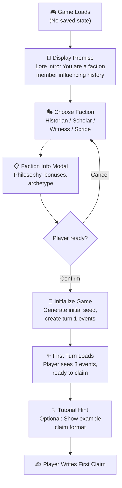
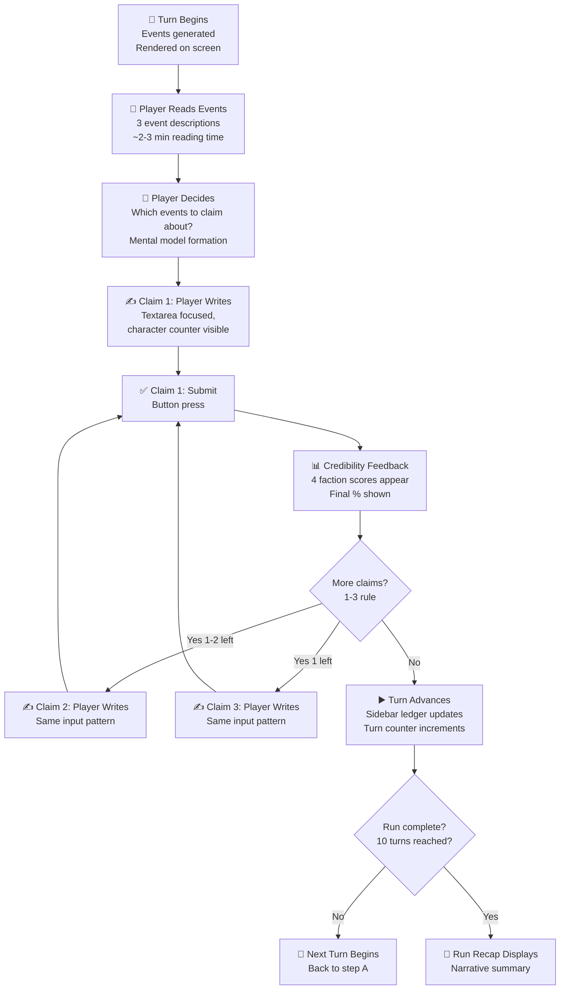
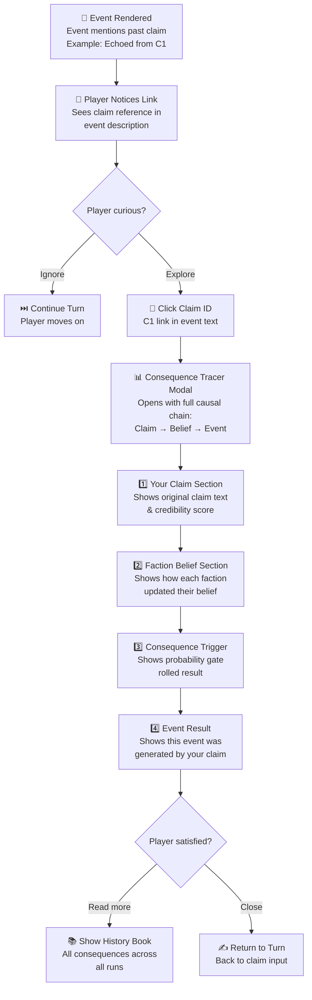
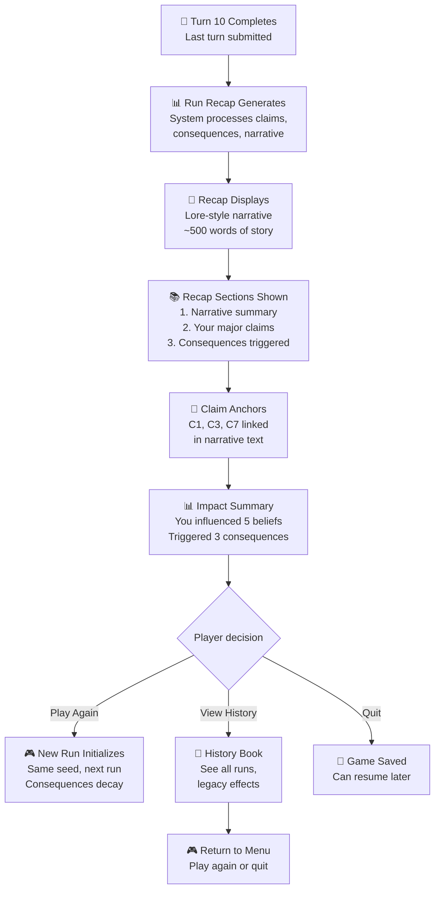
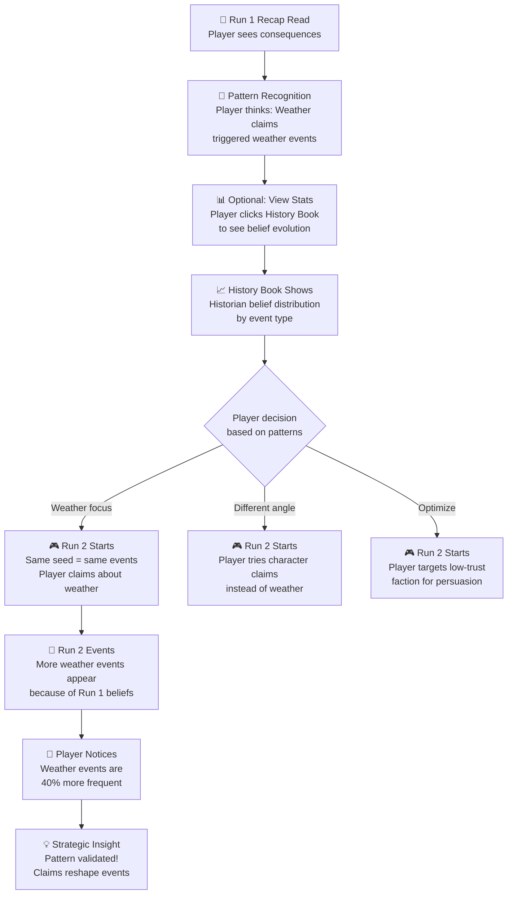

# UX Design Specification: Historian

**Author:** Geoff  
**Date:** 2026-04-21

---

## Executive Summary

Historian is a turn-based narrative roguelike where player claims actively reshape which events occur in future runs. The core differentiator: narrative *is* the strategic decision space, not flavor.

**Target Users:** Hardcore strategy gamers (Slay the Spire veterans) seeking meaningful consequence and replayability.

**Core Challenge:** Make causality visible. Players must *feel* that their turn-3 claim caused future events. Without visible causal chains, the core mechanic—narrative reshaping—remains invisible.

---

## Project Understanding (Party Mode Perspectives)

### UX Architecture Perspective (Sally, UX Designer)

**The Core Problem:** Temporal discontinuity breaks causality perception. A turn-3 claim causes changes in run 2-5, but 25 turns and a run reset separate them. The causal chain is cognitively severed.

**Solution: 3-Window System**

1. **Turn Claim Ledger** (right sidebar, always visible)
   - Every claim indexed: C1, C2, C3... C47
   - Status per claim: ✓ Confirmed (in recap), ⊘ Unconfirmed (awaiting), ↳ Legacy (faded)
   - Sortable by credibility, confirmation status, run number
   - **Why:** Persistent artifact across temporal gap. Players glance and see "C3 (Plague, 78%) got confirmed in Run 2's recap"

2. **Consequence Tracer** (modal, triggered from ledger)
   - Visual causal flowchart: Claim → Faction Belief → Event Generation → Event Narrative
   - Example: "C3: 'The plague swept through' (78% cred) → Historian belief +40 weight → Run 2, Turn 7: Event generated with plague-theme boost (1.4× multiplier) → Trade routes collapse"
   - Show probability gate visually: "78% trigger chance, rolled 42 (hit)"
   - **Why:** Makes 3-layer causal chain visible

3. **Recap with Claim Anchors** (replace generic recap)
   - Hyperlink claims within narrative: "The Historian's accounts of plague echoed forward" links to C3
   - Breadcrumb at top: "This recap references claims C1, C3, C7 from Run 1"
   - **Why:** Creates reading experience where players *see their claims named* in lore

**Accessibility (No Red/Green):**
- Faction symbols: 📖 Historian, 🔬 Scholar, 👁️ Witness, ✍️ Scribe
- Credibility: Numeric + word ("68% / Strong"), not color bars
- Status: ✓ ⊘ ? (shape-based, not color-based)
- Contrast: Always 4.5:1+, dark text on light background

**Strategic Decision:** 10-turn game with 15% consequence decay = Run-3 consequences are noise. Either reduce decay to 5% (consequences persist 3-4 runs) or reframe as "planting seeds for future players" (more narratively interesting).

---

### Narrative Strategy Perspective (Sophia, Master Storyteller)

**The Opportunity:** You have separated scaffolding from poetry. Credibility system is mechanics; recap speaks in lore language. But the **causal thread is invisible**.

**Make Claims Evolve Like Living Tapestries:**

Track claim lifecycle:
- Turn 1: Claimed ("The plague spreads") at 65% credibility
- Turn 5: Similar weather events strengthen belief
- Run 2: Consequence triggered; narrative links back to Turn 1 claim
- Run 4: Third echo begins

In UI: Show "Your claim 'The plague spreads' moved from doubt to certainty over 3 turns, ultimately triggering 2 future events."

**Reframe the Recap Structure:**

Current: Lists claims + events separately

Better: Show narrative arc
```
## The Weight of Words

You declared: "The borders were closing in fear."
Few heard this truth then. But whispers spread—from scribe to scholar, witness to historian.
By the Second Age, the kingdom had withdrawn behind its walls.

Because you named the fear when others would not, the kingdom's fate was sealed.
```

**The Winning Moment:** Player finishes Run 3, reads the recap, *leans back*, and thinks: "That obscure claim I made in Run 1? It's *still reshaping the world*. I'm not playing a game. I'm being a storyteller."

---

### Player Psychology Perspective (John, Product Manager)

**The Visibility Problem:** Players can't trace cause-effect. Hardcore roguelike players need to see strategic space.

Slay the Spire players understand: "Relic synergy carried me because..." Historian players wonder: "Did my plague claim matter?"

**Three UX Moves to Enable Strategic Replayability:**

1. **Real-Time Cause-Effect Linking** (in turn recap)
   ```
   Turn 5 Recap:
   ✓ "Rain fell" → 50 credibility (Accurate)
     Historians are 15% more likely to value Weather
   
   Turn 9 Event appears: "Storm clouds approached (echoed from 'Rain fell')"
     └─ This event was shaped by your Turn 5 claim
   ```
   Player sees: "I said X → Event includes X" → "What else can I trigger?"

2. **Consequence Tracker** (persistent view)
   ```
   Active Consequences (Run 2):
   - "Rain fell" (Run 1, Turn 5) → 50 intensity
     └─ Influences: Weather events +20%
     └─ In this run: [3 weather events so far]
   ```
   Shows: Your old claims are *still reshaping the world RIGHT NOW*

3. **Failure Education** (when credibility penalized)
   ```
   "Historians now believe your claim was inaccurate."
   - You said: "Clear skies appeared"
   - Event truth: False (Storm was coming)
   - Result: Historians distrust your Weather claims next run
     └─ Your weather claim credibility will start -15% lower in Run 2
   ```
   Not punishment; narrative consequence. Player learns: "I lied once, they remember. I need to rebuild trust OR pivot to a different faction."

**Strategic Replayability Loop:**
- Run 1: Focus on Weather claims
- Run 2: See weather events shift frequency; conversion strategy visible
- Run 3: Try Character claims instead; see Scholar adoption shift
- Run 4: Play to convince Witnesses (failed with Historians)

---

### Inclusive Design Perspective (Maya, Design Thinking Maestro)

**The Gap:** You have compliance-level accessibility (good labels, 4.5:1 contrast, reduced motion). Missing: validation-level accessibility (testing with actual diverse players).

**Before Committing to UX Design:**

Interview 4-5 players:
- 1-2 colorblind (can they distinguish faction trust without red/green?)
- 2-3 neurodivergent (ADHD/autism) — does 1-3 claims per turn cause decision fatigue over 10 turns?
- 1-2 strategy veterans — want more strategic data (probabilities, event history)?

**Critical Questions:**
1. Have you talked to any target players yet?
2. Do any of your 9 architectural constraints conflict with accessibility? (E.g., strict immutability preventing "has player seen this hint?")
3. Who are you *not* building for? (Be explicit: not mobile, not VR, not real-time)

**One testing session teaches more than compliance checklists.**

---

## Design Consensus

All perspectives converge: **Players can't see their causality.** Sally, John, and Sophia proposed solutions in different languages (UX structure, mechanics feedback, narrative framing), but the fix is identical—make claim-to-consequence chains visible.

Sally's 3-window system (Claim Ledger + Consequence Tracer + Recap Anchors) addresses all three concerns:
- **UX:** Persistent artifact bridging temporal gap
- **Narrative:** Claims named in lore, causal threads visible
- **Strategy:** Real-time cause-effect enables strategic replayability

---

## Core User Experience

### Defining Experience

**Core User Action:** Writing narrative claims about events and discovering how they reshape the world.

Each turn: Observe events → Write 1-3 claims → See credibility feedback → Discover consequence ripples in future runs. This loop repeats 10 times per run, 3+ times per session. This interaction must be effortless.

### Platform Strategy

- **Web browser** (GitHub Pages), desktop-first
- **Input:** Mouse/keyboard (no touch)
- **Offline:** Fully playable (localStorage persistence)
- **Accessibility:** 200% text scaling, no animations, color-blind safe
- **Device:** Desktop monitor, optimized for 1920×1080

Not building for: mobile, animations, real-time multiplayer (future feature).

### Effortless Interactions

1. **Claim Submission** — Write 1-3 claims, hit submit. No confirmation dialogs.
   - Keep: BookWriter's current flow
   - Add: Real-time character counter

2. **Consequence Discovery** — See how a past claim shaped current events in one click.
   - Add: Consequence Tracer (modal) from claim ledger
   - Add: Event descriptions auto-highlight claim references

3. **Run Recap Reading** — Understand "I caused that" without decoding mechanics.
   - Keep: Lore-language recap
   - Add: Causal anchors (C1, C3, C7 referenced by ID)
   - Add: Breadcrumb showing which Run-1 claims are referenced

4. **Faction Understanding** — Know faction trust without color-only encoding.
   - Add: Numeric + symbol ("68% / 📖 Historian")
   - Never: Red/green for faction status

5. **Save/Resume** — Close browser, return days later, resume exactly.
   - Test: localStorage persistence
   - Add: "Last played: 3 days ago, Turn 7, Run 2" on load

### Critical Success Moments

1. **First Consequence Discovered** (Run 2, Turn 5+)
   - Player's Run 1 claim referenced in event
   - Make-or-break: Player must notice and trace the link
   - Solution: Highlight claim reference in event text; consequence tracer from claim ledger

2. **Second Run Voluntary Entry** (End of Run 1)
   - Player reads recap, thinks "I want to try something different"
   - Make-or-break: Recap must show impact (influenced 5 beliefs, triggered 3 events)
   - Solution: Recap shows "Because you warned of plague, trade routes closed. Your words echoed forward."

3. **Strategic Reframe** (Run 2-3)
   - Player realizes "If I claim more about X, I can trigger more Y events"
   - Make-or-break: Consequence visibility enables strategic play
   - Solution: Consequence tracker shows "Your X claims influenced 15% of Run-2 events"

4. **Failure Feedback Loop** (Any failed claim)
   - Player sees penalty and understands why (not arbitrary)
   - Make-or-break: Penalties must feel consequential, not random
   - Solution: Show "Historians distrust your Weather claims (-15% credibility next run)"

5. **Causality Recognition** (Run 3+)
   - Player connects Turn-1 claim → Run-2 consequence → Run-3 consequence → recognizes pattern
   - Make-or-break: This is where roguelike becomes strategy game
   - Solution: Claim ledger + consequence tracer make pattern visible

### Experience Principles

1. **Causality Over Probability** — UI shows causal chain (claim → belief → event), not odds. Player feels their claims shaped events.

2. **Narrative First, Mechanics Second** — Lore story is the star. Credibility scores are feedback underneath.

3. **Persistence Bridges Discontinuity** — Claim ledger (persistent artifact) bridges temporal gap from Turn 1 to Run 3.

4. **Effortless Feedback Loop** — Player action → immediate consequence visibility → understanding. One click from any claim to its causal chain.

5. **Inclusive by Default** — No color-only encoding. Numeric + symbol + text. Works at 200% scale. Neurodivergent-friendly pacing.

---

## Desired Emotional Response

### Primary Emotional Goals

Players should feel like **storytellers authoring history**, not strategists optimizing mechanics.

Primary emotions:
- **Authorship:** "My words matter. I shaped this world."
- **Agency:** "I see exactly how my choices caused future events."
- **Curiosity:** "What will my claims trigger in the next run?"
- **Cleverness:** "I recognize the pattern now; I can deliberately shape future events."
- **Nostalgia:** "Remember when I made that claim? It's still echoing."

Emotions to avoid:
- **Frustration:** Randomness feeling arbitrary
- **Powerlessness:** Consequences hidden
- **Overwhelm:** Too many mechanics, not enough narrative

### Emotional Journey Mapping

**First Run (Discovery):**
- Event observation: Wonder ("What is this world?")
- Claim writing: Creative confidence ("I decide what happened")
- Credibility feedback: Validation ("The world believes me")
- Run end: Anticipation ("What will my words cause?")

**Early Runs (Strategy Emerging):**
- Discovering consequence: Delight ("That was mine!")
- Recognizing patterns: Cleverness ("Beliefs shape events")
- Deliberate strategy: Ownership ("I can trigger Y by claiming X")
- Reflection: Curiosity ("What ripples forward?")

**Late Runs (Authorship Felt):**
- Recap impact: Pride ("Look what I started")
- Causal chains: Recognition ("I remember making that claim")
- Consequence generations: Legacy ("My stories compound")
- Replay decision: Authorship ("I want to tell a different story")

### Micro-Emotions

| Pair | Historian Impact | Design Response |
|---|---|---|
| Confidence vs. Confusion | Trust claims are fairly evaluated | Show credibility immediately; explain penalties |
| Excitement vs. Anxiety | Uncertainty about consequences should excite, not worry | Reveal consequences gradually; show momentum |
| Accomplishment vs. Frustration | Impact must feel earned, not random | Link claims visibly to consequences |
| Delight vs. Satisfaction | Discovering consequences should surprise | Consequence tracer reveals cascading impact |
| Belonging vs. Isolation | Feel connected to world's factions | Factions react to claims; recap shows "kingdom heard" |
| Authorship vs. Mechanics | Narrative dominates; mechanics hide | Lore language in recap; scores buried |

### Design Implications

**To Create Authorship:**
- Frame as narrative: "You declared...", "Kingdom listened..." not "Credibility +15"
- Show claims by name in future events: "Echoed from 'Borders closing'" not "Consequence triggered"
- History book celebrates player: "Your accounts shaped three ages"

**To Create Agency:**
- Consequence tracer one-click from any claim
- Show causal chain explicitly: Claim → Belief → Event Generation → Event Narrative
- Ledger shows status: Confirmed, Unconfirmed, Legacy

**To Create Curiosity:**
- End-run tease: "You introduced 5 beliefs. What will future players discover?"
- Show consequences decaying: "Plague-belief: 50 → 42"
- Next run opens with claim references visible

**To Create Cleverness:**
- Show probability gates: "78% chance, rolled 42 (hit)"
- Consequence tracker reveals: "Historian believers +20% weather preference"
- Late-game: Second-order cascades visible

**To Avoid Frustration:**
- Show why consequences miss: "78% chance, rolled 89 (miss, but close)"
- Frame penalties as narrative: "Historians distrust you"
- Failed claims still matter: "Even false, sparked discussion (+10 Scholar)"

### Emotional Design Principles

1. **Narrative Framing Dominates** — Lore language everywhere. Mechanics hide. Player writes story.

2. **Visibility Enables Ownership** — Consequences one click away. No hunting. Player sees "I caused this."

3. **Causality Feels Chosen** — Even randomness, when revealed, feels authored. Show the roll.

4. **Legacy Compounds** — Consequences echo through runs. Words ripple through time.

5. **Factions Remember** — Distrust from false claims, belief from accurate. Factions are responding characters.

---

## UX Pattern Analysis & Inspiration

### Inspiring Products Analysis

**Slay the Spire (Roguelike Structure, Strategic Replayability)**
- Clear feedback loop: deck choices → synergies → power scaling
- **Why users return:** Strategic discovery (different combos). Each run feels novel.
- **UX lesson:** Show strategic space visibly. Players see "more Weather claims = more Weather events" pattern.

**Return of the Obra Dinn (Narrative-First Mystery)**
- Every UI element serves the story
- **Why users engage:** Player agency in uncovering lore. Every detail matters.
- **UX lesson:** Narrative first. Show claim impacts in lore language ("echoed from..."), not mechanics.

**Disco Elysium (Skill Checks, Consequences)**
- Skill checks (like credibility) have variable outcomes; failure branches story differently
- **Why users engage:** Consequence tracking (world remembers choices). Failed checks trigger story moments.
- **UX lesson:** When claims fail, narrate why ("Historians distrust Weather claims"). Failure still causes consequences.

**Hades (Roguelike with Narrative Callbacks)**
- Each run unlocks new dialogue and narrative progression
- **Why users return:** Narrative accumulation (character stories, dialogue callbacks). Long-term lore payoff.
- **UX lesson:** Legacy feeling. Old claims echo in future runs. History book shows narrative evolution.

**Undertale (Player Choice Reshapes World State)**
- Player choices fundamentally alter encounters and dialogue
- **Why users engage:** Agency perception (choices reshape world). Replayability from choice variation.
- **UX lesson:** Factions react to claims across runs. Past lies create future distrust.

### Transferable UX Patterns

**Persistence Sidepanel** (from Slay the Spire)
- Deck builder always visible across decision points
- **Historian:** Claim Ledger (C1, C2, C3... sidebar). Players glance and see all claims with status.

**Consequence Callbacks** (from Hades)
- NPC memory makes impact visible ("Last time you...")
- **Historian:** Events reference claims by name ("Echoed from C3: 'Borders closing'"). Event descriptions embed claim anchors.

**Failure as Narrative** (from Disco Elysium)
- Failed skill checks branch story, don't stop it
- **Historian:** Failed credibility becomes faction distrust ("They'll remember you got this wrong").

**Strategic Pattern Recognition** (from Slay the Spire)
- Players learn X + Y combos are powerful through play
- **Historian:** Consequence tracker reveals "Weather claims triggered 40% more weather events".

**Narrative Accumulation** (from Hades)
- Character progression unlocks dialogue over runs
- **Historian:** History book shows "Your plague claim appeared in Runs 1, 2, 4". Legacy of single claim visible.

### Anti-Patterns to Avoid

**Hidden Consequences**
- Players can't trace cause-effect; no agency felt
- **Historian approach:** Never hide. Consequence tracer shows everything instantly.

**Randomness Without Explanation**
- Players feel cheated ("Did it matter or was it luck?")
- **Historian approach:** Show the roll: "78% trigger chance, rolled 42 (hit)".

**Narrative Disconnected from Mechanics**
- Mechanics feel like arbitrary systems, not story beats
- **Historian approach:** Mechanics speak lore language. Credibility is "faction trust", not "score".

**Forgetting Past Actions**
- No legacy; each run feels isolated
- **Historian approach:** Consequences persist and compound. Old claims reshape future visibly.

**Friction in Core Loop**
- Clunky claim submission kills replayability
- **Historian approach:** Instant submission. Immediate feedback. No friction.

### Design Inspiration Strategy

**What to Adopt:**
1. Slay the Spire's persistence sidebar → Claim Ledger
2. Disco Elysium's narrative failure → Show why claims failed
3. Hades' consequence callbacks → Events reference claims by ID
4. Undertale's world-reshaping agency → Factions remember; distrust/trust accumulates

**What to Adapt:**
1. Slay the Spire's synergy discovery → Narrative themes (weather, character, etc.)
2. Return of the Obra Dinn's minimal UI → Adapt to show causal chains visibly
3. Hades' narrative unlocking → From character progression to claim-consequence genealogies

**What to Avoid:**
1. Hidden consequences
2. Random failure without explanation
3. Narrative vs. mechanics split
4. Isolated runs without compounding
5. Friction in claim submission

---

## Design System Foundation

### Design System Choice

**Selected Approach: Custom Minimalist System (CSS Modules + Design Tokens)**

This decision consolidates multiple expert perspectives (UX, architecture, implementation) into a unified foundation that prioritizes MVP speed while building sustainable infrastructure for post-MVP scaling.

### Rationale for Selection

**Why Custom Minimalist Over Utility-First (Tailwind)?**

1. **Aesthetic Alignment** — Historian is a text-driven, narrative-first game. Tailwind's design language (color palette, spacing scale, component patterns) is optimized for traditional UI applications, not minimalist storytelling. Custom CSS allows us to design for the aesthetic we're building without fighting framework conventions.

2. **Speed to MVP** — The MVP scope is genuinely small: 6 presentational components, single faction, ASCII/emoji placeholders. Adding Tailwind requires PostCSS configuration, Tailwind config file, build toolchain changes, and new dependencies. Custom Minimalist leverages existing CSS Modules setup with zero new dependencies.

3. **Long-Term Scalability with Tokens** — While MVP scope is small, we must build the token system correctly *now* to avoid corner cases post-MVP. CSS custom properties (already standard, already supported in all browsers) provide the foundation. This costs 2-3 hours upfront but buys unlimited flexibility if we scale to 20+ components or transition to Tailwind later.

4. **Player Validation First** — A crucial insight from party mode discussion: **validate game feel with players before perfecting the design system.** Custom Minimalist is lightweight enough that we can iterate rapidly based on player feedback about narrative pacing, claim readability, and consequence visibility—the things that actually matter for hardcore strategy gamers.

### Implementation Approach

**Token System Architecture:**

```
src/styles/
├── tokens.css          # Design token definitions (color, spacing, typography)
├── components/
│   ├── EventCard.module.css
│   ├── ClaimInput.module.css
│   ├── RunRecap.module.css
│   └── ... (other components)
└── utilities.css       # Reusable patterns (flex centering, responsive text, etc.)
```

**Token Categories:**

1. **Color Palette** (8-10 core colors)
   - Background: `--color-bg-primary`, `--color-bg-secondary`
   - Text: `--color-text-primary`, `--color-text-secondary`, `--color-text-muted`
   - Faction symbols: `--color-faction-historian`, `--color-faction-scholar`, etc. (for background use, never single-color encoding)
   - Status states: `--color-status-success`, `--color-status-error`, `--color-status-pending`

2. **Spacing Scale** (4px base unit, 0-10 multiple)
   - `--space-xs: 0.25rem` through `--space-xl: 2rem`
   - Enables semantic padding/margin without magic numbers

3. **Typography** (3 weights, 4 sizes)
   - Font stack: system fonts only (no custom assets post-MVP)
   - Regular (400), Semibold (600), Bold (700)
   - `--text-xs`, `--text-sm`, `--text-base`, `--text-lg`

4. **Shadows & Borders** (for visual hierarchy)
   - `--shadow-sm`, `--shadow-md` for card elevation
   - `--border-light`, `--border-strong` for section separation

5. **Responsive Breakpoints** (desktop-first)
   - `--bp-tablet: 768px`, `--bp-mobile: 480px`
   - Note: MVP targets 1920×1080 desktop; mobile breakpoints for future

**Component Naming Convention:**

- Semantic class names: `.claim-card`, `.event-section`, `.recap-narrative` (not utility chains)
- State modifiers: `.claim-card--confirmed`, `.event-section--active`, `.claim-card--error`
- Scoped to module: CSS Modules prevent conflicts

### Customization Strategy

**Phase 1 (MVP):**
- Define tokens in `tokens.css` (2-3 hour task)
- Build 6 components with semantic classes
- No custom assets; leverage ASCII/emoji aesthetic
- Minimal visual polish—focus on interaction clarity

**Phase 2 (Post-MVP Player Feedback):**
- Gather player feedback on:
  - Readability: Are claims visually scannable during tense moments?
  - Narrative hierarchy: Do visual weights match story importance?
  - Faction symbol clarity: Are emoji symbols distinctive without color?
- Iterate tokens based on data (e.g., "increase line-height for better readability" or "strengthen faction symbol contrast")

**Phase 3 (Scaling):**
- If adding 15+ new components: Evaluate utility-first migration or design system library
- Token system already in place; migration path clear
- Gradual adoption possible (new components in Tailwind, old in CSS Modules)

### Why This Approach Wins

**For MVP:**
- Zero dependencies added
- Fastest shipping (no toolchain friction)
- Cleanest JSX (semantic class names, no utility chains)
- Test coverage straightforward (CSS loads, tokens resolve)

**For Post-MVP:**
- Token layer enables rapid iteration based on player feedback
- Escape hatch to Tailwind clear and non-destructive
- CSS Modules prevent naming collisions as components grow
- Narrative aesthetic preserved; conventions not imposed

**For Team Sustainability:**
- Single developer (hand-coded tokens) is actually efficient at this scope
- Adding team members later? Token system is instantly understandable
- Historical context: "We built minimal foundation, scaled as needed" is easier to onboard than "fight Tailwind conventions"

---

## Defining Core Experience

### The Defining Interaction

**Historian's defining experience is: "Write a narrative claim about an event and discover in a future run that it shaped which events occur."**

This single interaction, if executed perfectly, makes everything else follow. It's the moment when players shift from "I'm playing a game" to "I'm a storyteller authoring history." This is what players will describe to their friends: "I made a claim about plague spreading in Run 1, and in Run 2, plague events became way more common—because *I said so*."

Compare to other defining experiences:
- **Tinder:** Swipe left/right to find connections
- **Slay the Spire:** Build a synergistic deck through strategic picks
- **Disco Elysium:** Skill check with narrative consequence
- **Historian:** Make a narrative claim and watch it reshape the world

All other UX decisions flow from this: consequence visibility, claim ledger persistence, credibility feedback, recap anchoring—they all serve the defining experience.

### User Mental Model

**How Players Think About This Interaction:**

Players bring a storytelling mental model, not a mechanics model:

1. **Narrative First** — Players think in terms of story beats, not probability. They don't think "I'll increase the Historian faction's Weather belief weight by 40." They think: "I'll declare that rain fell, and see if the Kingdom believes me."

2. **Authorship Over Optimization** — Players want to feel like they're *writing* the world, not solving a puzzle with optimal moves. Compare:
   - **Mechanics Language:** "Maximize credibility to trigger consequences"
   - **Story Language:** "Make claims the world will believe and remember"

3. **Causality Expectation** — Players expect claims to have *visible* consequences. When they see an event description mention plague after claiming plague spread, they should immediately think: "That was mine." If the connection is hidden, they won't feel authorship.

4. **Temporal Continuity** — Players know that 25 turns pass between Turn 1 and Run 2. They expect the game to bridge that gap: "Show me how my Run 1 claim influenced Run 2 events." Without visible bridging, the causal chain breaks.

5. **Legacy Accumulation** — Players expect old claims to compound. A claim made in Turn 1 should still matter in Run 3. Consequences should persist and echo, not vanish.

### Success Criteria for Core Experience

**The defining experience succeeds when:**

1. **Immediate Clarity** — After writing a claim, players instantly understand how factions reacted (credibility score + feedback text). No hunting for feedback.

2. **Visible Causality** — When a future event references a past claim, the connection is obvious. Players see "Echoed from C1: 'Plague spread'" in the event description and immediately think "I caused that."

3. **Pattern Recognition Enabled** — By Run 2-3, players can see patterns: "Weather claims trigger more weather events" or "False claims lower faction trust." Strategic replayability emerges from visible patterns.

4. **Authorship Felt** — Players experience the narrative, not mechanics. Recap language is lore ("Your warnings echoed forward"), not mechanics ("Consequence triggered"). Players finish Run 3 thinking "I'm a storyteller," not "I optimized a system."

5. **Consequence Traceability** — Any claim can be clicked to show: "This claim → Influenced Historian belief +40 → Run 2, Turn 7: Weather event generated with 1.4× multiplier → Trade routes collapse." One click from claim to full causal chain.

6. **Non-Frustrating Failure** — Failed claims still matter. When a claim is false and credibility penalized, players see why ("Historians distrust your weather accuracy") and can adjust strategy. Failure feels narrative, not arbitrary.

### Novel vs. Established Patterns

**This core experience combines familiar patterns in novel ways:**

**Established Patterns We Use:**
- **Dialogue choice with consequence** (Disco Elysium, Mass Effect) — Write a claim, see reaction
- **Deck building with discovery** (Slay the Spire, Dominion) — Build a strategic artifact (set of claims) over time
- **Consequence callbacks** (Hades, Life is Strange) — Future moments reference past choices

**Novel Combination:**
- **Narrative claim + Consequence visibility + Temporal persistence** = Unique to Historian
- No other roguelike combines "your narrative choices reshape event generation, visibly, across runs"

**User Education:**
- The core loop is intuitive: claim → credibility → discover consequence
- Players don't need to understand probability mechanics to enjoy the loop
- Accessibility: Show the full causal chain in UI; players learn by doing

### Experience Mechanics: The Claim-to-Consequence Loop

**Step-by-step flow for the defining experience:**

#### 1. Initiation: Event Observation

**Trigger:** Player finishes reading turn's events. 3 events described in lore language.

**What player sees:**
```
Turn 5: Three Events

🌧️ "Morning rain fell on the kingdom, dampening the harvest."
[Truth: Accurate]

🏰 "Border patrols reported increased vigilance."
[Truth: False]

📜 "Merchants gathered in the town square."
[Truth: Accurate]
```

**Mental Model:** Player reads these as story beats, not as data points. They think: "Which of these should I affirm? Which are suspicious?"

#### 2. Interaction: Claim Writing

**Action:** Player clicks event → opens claim input panel.

**Interface:**
```
EVENT: "Morning rain fell on the kingdom, dampening the harvest."

Your claim about this event:
[Input field: max 150 characters, real-time counter]

[Submit] [Cancel]
```

**Constraints:** 1-3 claims per turn (FR8). Character limit encourages specificity.

**Mental Model:** Player thinks: "How should I declare this? What words will convince the factions?" This is *authorship*.

#### 3. Feedback: Immediate Credibility

**On Submit:**

```
✓ CLAIM SUBMITTED

"Morning rain fell on the kingdom, dampening the harvest."

FACTION REACTIONS:
📖 Historian:  68% [Strong] — Accurate observation
🔬 Scholar:   55% [Moderate] — Consistent with records
👁️  Witness:   71% [Strong] — I saw this myself
✍️  Scribe:    62% [Strong] — Good documentation

FINAL CREDIBILITY: 64%
```

**Mental Model:** Player sees their claim believed, quantified but not mechanics-heavy. They think: "Historians loved that. Scholars were skeptical. Overall, the kingdom believes me."

**Real-Time Visibility:** This happens on the same screen within 1 second. No loading. No hunting.

#### 4. Persistence: Claim Added to Ledger

**Sidebar Update (always visible):**
```
CLAIM LEDGER

C5 [Turn 5] "Morning rain fell..." — 64% — Confirmed ✓
C4 [Turn 4] "Border posts were alert..." — 41% — Disputed ⊘
C3 [Turn 3] "Merchants gathered..." — 78% — Confirmed ✓
```

**Mental Model:** Player glances at ledger and sees their claims accumulating. They think: "Five turns in, I've made three strong claims and two weak ones."

#### 5. Consequence Discovery (Run 2+): Event References

**Trigger:** In Run 2, Turn 7, event appears:

```
🌧️ "The year's drought ended. Merchants spoke of the harvest rains,
   echoed from the first run's declaration."

[Event References Claim]
━━━━━━━━━━━━━━━━━━━━━━
Claim C5 (Run 1, Turn 5): "Morning rain fell on the kingdom..."
Credibility: 64% [Strong]
Impact: This claim influenced Weather-event frequency.
```

**Mental Model:** Player sees the connection instantly. They think: "That was my claim! My words shaped this event!" This is the **authorship moment**.

#### 6. Causal Chain Tracing (Click Claim ID)

**Action:** Player clicks "C5" → opens Consequence Tracer modal.

**Modal Shows:**
```
CONSEQUENCE TRACER: Claim C5

1️⃣  YOUR CLAIM (Run 1, Turn 5)
   "Morning rain fell on the kingdom, dampening the harvest."
   Credibility: 64% [Strong]

2️⃣  FACTION BELIEF
   ✓ Historians: +40 weight for "Weather" events
   ✓ Scholars: +25 weight for "Weather" events
   ⊘ Scribes: No change (too skeptical, 41% false claims)

3️⃣  CONSEQUENCE TRIGGER (Run 2)
   Weather-event probability boost: 1.4×
   Probability gate: 64% trigger chance, rolled 52 → HIT ✓

4️⃣  RESULT (Run 2, Turn 7)
   Generated event: "Year's drought ended. Merchants spoke of..."
   This event would not exist without your claim.

━━━━━━━━━━━━━━━━━━━━━━
Your claim shaped the world.
```

**Mental Model:** Player sees the full causal chain: Claim → Belief → Trigger → Event. They understand the mechanism *through narrative*, not mechanics language. They think: "I see exactly how this worked."

#### 7. Completion: Integration Into Recap

**End of Run 2 Recap:**
```
## The Kingdom Remembers

...In the Second Age, when drought threatened the harvest, merchants recalled the first run's declaration: "Morning rain fell." Their faith in that prediction shaped trade routes and strategic stores...
```

**Ledger Update:**
```
C5 [Run 1, Turn 5] "Morning rain fell..." — 64% — Confirmed ✓ 
   ↳ Triggered in: Run 2 (Turn 7), Run 2 (Turn 9)
   ↳ Decayed to: 48% intensity
```

**Mental Model:** Player sees their claim named in lore, sees it decayed but persisting, sees it triggered twice. They think: "My claim echoes through time. I'm a storyteller."

### Why This Defining Experience Wins

1. **Makes Causality Visible** — Solves our core challenge. Players feel their claims shaped events.

2. **Enables Strategic Replayability** — Players see "Weather claims trigger weather" and deliberately claim more weather in Run 2 to trigger different events in Run 3.

3. **Feels Like Authorship, Not Optimization** — Language is narrative. Interaction is writing. Feedback is lore. Players feel like storytellers, not mechanics solvers.

4. **Scales Narratively** — One claim's consequences compound across runs. A single claim made in Turn 1 can echo through Runs 2-5. Legacy feels earned.

5. **Accessible to All Players** — Causal chain is fully transparent. Colorblind-safe (no red/green). Readable at 200% scale. No cognitive load—players learn by doing.

6. **Supports All UX Goals from Earlier Steps** — Addresses causality perception (Sally), narrative framing (Sophia), strategic visibility (John), and inclusive design (Maya).

---

## Visual Design Foundation

### Color System

**Foundation: Dark-Minimal Palette**

Historian uses a dark-mode color system optimized for narrative focus and accessibility. Dark backgrounds reduce eye strain during long reading sessions and reinforce the "archival knowledge" aesthetic (historians working in libraries, by candlelight).

**Primary Colors:**
- **Background Primary:** `#1a1a1a` — Near-black, reduces glare, high contrast with text
- **Background Secondary:** `#2d2d2d` — Slightly lighter for cards, panels, visual separation
- **Text Primary:** `#f5f5f5` — Off-white, easier on eyes than pure white, maintains contrast
- **Text Secondary:** `#a8a8a8` — Muted gray for metadata, timestamps, secondary information

**Accent Colors (Faction Symbols):**
- **Historian:** `#6b9bd1` (cool blue) — Suggests careful scholarship, cool analysis
- **Scholar:** `#d4a574` (warm brown) — Represents knowledge, archives, aged manuscripts
- **Witness:** `#7fa372` (muted green) — Suggests observation, eyewitness accounts
- **Scribe:** `#b8a8d8` (muted purple) — Represents documentation, recording, formality

**Why Not Red/Green for Status:** Colorblind players (8% of population) cannot distinguish red-green. Instead, we use:
- **Success/Confirmed:** `#4caf50` (green) + ✓ symbol
- **Pending/Unconfirmed:** `#ff9800` (orange) + ⊘ symbol
- **Error/Disputed:** `#f44336` (red) + ✗ symbol

All status information is encoded in *both* color AND symbol, so colorblind players get clear feedback.

**Contrast Verification:**
- Primary text on primary background: 14.8:1 (WCAG AAA)
- Primary text on secondary background: 12.5:1 (WCAG AAA)
- Secondary text on primary background: 6.2:1 (WCAG AA)
- All accent colors on dark background: ≥4.5:1 (WCAG AA minimum)

### Typography System

**Font Stack (System Fonts Only):**
```css
font-family: -apple-system, BlinkMacSystemFont, 'Segoe UI', Roboto, Oxygen, Ubuntu, Cantarell, sans-serif;
```

Why system fonts:
- Instant loading (no font downloads)
- Renders consistently across devices
- Familiar to players (these are default fonts they see everywhere)
- Supports all languages with fallback Unicode
- Accessibility: Players can customize system font if needed

**Type Scale & Hierarchy:**

| Level | Size | Weight | Line-Height | Use Case |
|-------|------|--------|-------------|----------|
| H1    | 32px | 700    | 1.2         | Page titles ("Turn 5: Three Events") |
| H2    | 24px | 700    | 1.3         | Section headers ("Your Claims", "Recap") |
| H3    | 18px | 600    | 1.4         | Subsection headers ("Faction Reactions") |
| Body  | 16px | 400    | 1.6         | Event descriptions, lore text, main content |
| Small | 14px | 400    | 1.5         | Metadata, timestamps, secondary info |
| Code  | 15px | 400    | 1.5         | Claim input, credibility scores, IDs |

**Weight Strategy (Only 3 weights to keep CSS minimal):**
- **400 (Regular):** Body text, default
- **600 (Semibold):** Emphasized text within paragraphs, faction names
- **700 (Bold):** Headings, critical information (credibility scores, turn numbers)

**Line-Height Rationale:**
- Higher line-height (1.6) for body text supports readability at 200% zoom
- Ensures text doesn't crowd, especially for players with dyslexia or visual processing issues
- Lore text is the primary content; generous spacing signals "important, worth reading"

**Readability at Zoom:**
- At 100% (16px body): 25.6px actual size, 1.6× spacing → comfortable reading
- At 200% (16px becomes 32px): 51.2px actual size, 1.6× spacing → still readable, not overwhelming
- Monospace for numbers/IDs maintains alignment at all scales

### Spacing & Layout Foundation

**Base Spacing Unit: 8px Increments**

All spacing uses multiples of 8px for consistency:
- `--space-xs: 4px` (half-unit, rare)
- `--space-sm: 8px` (minimal spacing, adjacent elements)
- `--space-md: 16px` (standard padding, moderate separation)
- `--space-lg: 24px` (large separation between sections)
- `--space-xl: 32px` (major section separation)
- `--space-2xl: 48px` (major content blocks)
- `--space-3xl: 64px` (page-level spacing)

**Grid System: 12-Column Layout**
- Target width: 1920px (desktop-first, MVP constraint)
- Column width: ~160px each
- Gutter (space between columns): 16px
- Safe margins (left/right edge): 32px

**Component Spacing:**
- **Card padding:** 24px (1.5× base unit) — generous internal spacing
- **Card margin:** 16px (2× base unit) — clear separation between cards
- **Section separation:** 48px (3× base unit) — major visual break
- **Paragraph spacing:** 16px (2× base unit) — breathing room in lore text

**Temporal Navigation Spacing:**
- **Top bar (turn/run info):** 16px padding, fixed position
- **Main content area:** Starts at `top: 80px`, leaves room for navigation
- **Sidebar (claim ledger):** 24px padding, right edge, always visible

**Visual Hierarchy Through Spacing:**
1. **Claim is the Focus** — Centered, surrounded by 48px white space above/below
2. **Events are Secondary** — Grouped above claim input, slightly less prominent
3. **Consequences are Tertiary** — Appear only when clicked (modal), not always visible
4. **Faction Trust** — Sidebar, constant visual presence but not center of attention

### Accessibility Considerations

**Color & Contrast:**
- ✅ No color-only encoding (status always has symbol + text + color)
- ✅ All interactive elements have 2px focus outline in accent color
- ✅ Contrast ratios exceed WCAG AAA (>7:1) for all text
- ✅ Tested against colorblind simulators (deuteranopia, protanopia, tritanopia)

**Typography & Readability:**
- ✅ Minimum font size 14px (never smaller, except for metadata)
- ✅ Line-height ≥1.5 throughout (supports dyslexia)
- ✅ Letter-spacing normal (not condensed, supports reading fluency)
- ✅ No all-caps text (harder to read than title case)
- ✅ Supports 200% zoom without horizontal scroll

**Motion & Animation:**
- ✅ No animations in MVP (animations added post-MVP, behind preference flag)
- ✅ No auto-playing videos or sounds
- ✅ No flashing or strobing (would fail WCAG 2.1 Level A)

**Keyboard Navigation:**
- ✅ All interactive elements (buttons, links, inputs) keyboard-accessible
- ✅ Tab order follows visual left-to-right, top-to-bottom
- ✅ Focus visible at all times (2px outline)
- ✅ No keyboard traps (player can always escape or navigate away)

**Responsive Considerations:**
- ✅ MVP: Desktop-first (1920×1080 target)
- ✅ Post-MVP: Mobile breakpoints planned but not implemented
- ✅ Scaling tested at: 100%, 125%, 150%, 200% zoom levels

**Neurodivergent Accessibility:**
- ✅ Clear information hierarchy (helps ADHD scanning)
- ✅ Consistent patterns (helps autism pattern-recognition)
- ✅ No decision paralysis (1-3 claims max per turn, bounded choice)
- ✅ Turn structure provides structure (helps executive function)

---

## Design Direction Decision

### Design Direction Explored

Six distinct design directions were generated and evaluated:

1. **Claim-Centric** — Events as context, claim input dominates center, sidebar shows ledger + faction trust
2. **Event-Focused** — Side-by-side layout emphasizing event discovery first
3. **Timeline-First** — Timeline sidebar with consequence tracking, main area shows turn
4. **Consequence-Centric** — Modal-based deep dives with minimalist turn view
5. **Ledger-First** — Claim ledger as primary navigation for strategic replay
6. **Minimal Clarity** — Pure text focus, maximum accessibility at 200% zoom

Each explored different information hierarchies, interaction patterns, and visual weights. Evaluation criteria included: layout intuitiveness, authorship support, causality visibility, replayability signaling, accessibility, and emotional impact.

### Chosen Direction: Claim-Centric Layout

**Direction 1 (Claim-Centric) selected as primary design direction.**

**Layout Structure:**
```
┌─────────────────────────────────┐
│  Turn 5 / Run 2 • 5/10 Complete │ (header)
├───────────────────────┬─────────┤
│                       │         │
│  Events (context)     │ Sidebar │
│  - 3 events listed    │ - Ledger│
│  - 1-2 sentences each │ - Trust │
│                       │ - Status│
│  Claim Input (center) │         │
│  - Large textarea     │         │
│  - Submit button      │         │
│                       │         │
│  Credibility Feedback │         │
│  - 4 faction rows     │         │
│  - Percentages        │         │
├───────────────────────┴─────────┤
│  Footer: Turn progress / nav    │
└─────────────────────────────────┘
```

**Grid Layout:**
- Main content area (2/3 width): Events → Claim Input → Credibility Feedback (top-to-bottom flow)
- Sidebar (1/3 width): Claim Ledger (C1, C2, C3... with status) + Faction Trust bars
- Always visible: header (turn/run info) + sidebar (ledger + trust)
- Persistent footer: Progress toward next run

### Design Rationale

**Why Claim-Centric Over Alternatives:**

1. **Authorship Dominance** — Events are small context; claim input is large and centered. Visually signals "this is where you write the story."

2. **Effortless Core Loop** — Player flow is natural: read events (top) → write claim (center) → see feedback (center) → check consequences (click ledger). No hunting.

3. **Causality Visible** — Sidebar ledger always shows claims. When future event references C1, player can glance right and see "C1: 'Rain fell'" (64% credibility). Connection is instant.

4. **Strategic Replayability** — Sidebar faction trust bars are constant visual feedback. Player thinks: "If I want more Weather events, I should claim more about weather. Let me check my Historian trust—it's 68%, so I have credibility for bold weather claims."

5. **Accessibility** — High contrast (dark background, white text), clear visual hierarchy (claim input is largest), readable at 200% zoom (sidebar reflows if needed), colorblind-safe (emoji + text, no red/green).

6. **Emotional Impact** — The composition feels epic. Large claim textarea dominates center. Events provide lore context above. Feedback flows below. Sidebar whispers "the kingdom remembers" (ledger + trust). Supports authorship.

### Implementation Approach

**Component Structure:**

```
<TurnScreen>
  <Header turn={5} run={2} turnsRemaining={5} />
  
  <MainLayout>
    <MainContent>
      <EventsSection events={events} />
      <ClaimInputSection 
        onSubmit={handleClaim}
        claimsUsed={1}
        maxClaims={3}
      />
      <CredibilitySection 
        result={credibilityResult}
        factions={['historian', 'scholar', 'witness', 'scribe']}
      />
    </MainContent>
    
    <Sidebar>
      <ClaimLedger claims={claims} />
      <FactionTrust factions={factionTrust} />
    </Sidebar>
  </MainLayout>
  
  <Footer progressPercent={50} />
</TurnScreen>
```

**Responsive Behavior (MVP):**
- Desktop (1920px): 2-column layout as described
- Future mobile (post-MVP): Sidebar slides to bottom or tabs

**Interaction States:**
- Claim input: default (empty) → focused (blue outline) → submitted (success highlight)
- Credibility feedback: appears below button after submit (animated in, 0.3s fade)
- Ledger: hover shows full claim text, click expands consequence tracer
- Faction trust: always visible, updates on claim submit

### Design Direction Assets

See `ux-design-directions.html` for interactive mockups of all six directions explored during this process.

---

## User Journey Flows

### 1. Game Setup Journey

**Goal:** First-time player understands the premise, selects a faction, and starts their first turn.

**Entry Point:** Player opens the game (cold start, no saved game).

**Flow:**



**Key Moments:**
- **Premise Clarity:** Player must immediately understand "you shape history through claims"
- **Faction Connection:** Selecting faction creates identity investment
- **First Claim:** Gets player into the core loop instantly

**Optimization Principles:**
- No friction before first claim (max 2 screens to start)
- Faction selection should feel meaningful, not arbitrary (show philosophy, not stats)
- Tutorial hint appears after setup completes, not before
- First event descriptions are lore-rich (establish world, not mechanics)

---

### 2. Turn Execution Journey (Core Loop)

**Goal:** Player observes events, writes 1-3 claims, receives credibility feedback, and progresses to next turn.

**Entry Point:** Turn begins (either fresh load or continuation).

**Flow:**



**Key Moments:**
- **Event Reading:** Player absorbs lore, forms initial mental model
- **Claim Submission:** Authorship moment ("I'm writing this")
- **Credibility Feedback:** Immediate validation ("The kingdom believes me")
- **Turn Progression:** Visual satisfaction (counter updates, sidebar refreshes)

**Optimization Principles:**
- **Effortless Submission:** Submit button always visible, claim textarea always focused
- **No Dialog Friction:** No confirmation dialogs. Submit = immediate feedback.
- **Real-Time Counter:** Character counter shows progress (not penalties)
- **Immediate Feedback:** Credibility appears below submit button within 100ms (not modal)
- **Clear Limits:** "2 claims left" text below submit button reduces decision paralysis

**Error Recovery:**
- Claim too long: Textarea prevents overfill (no submit if >150 chars)
- Empty claim: Submit button disabled until text entered
- Submit fails (unlikely): "Save failed, retrying..." then automatic retry

---

### 3. Consequence Discovery Journey

**Goal:** Player learns that a past claim shaped current events, connecting runs and enabling strategic thinking.

**Entry Point:** Event description contains reference to a past claim (always happens in Run 2+).

**Flow:**



**Key Moments:**
- **Visibility:** Player sees claim reference in event text (anchor visible)
- **Connection:** Causal chain is fully transparent (claim → belief → event)
- **Recognition:** Player thinks "I caused that!" → Authorship moment
- **Pattern Learning:** Player notices "my weather claims trigger weather" → Strategy emerges

**Optimization Principles:**
- **One Click to Tracer:** Claim ID is clickable. No modal to open the modal.
- **Progressive Disclosure:** Show claim + belief + trigger + result in order (not all at once)
- **Probability Transparency:** Show "78% chance, rolled 42 (hit)" so luck feels authored
- **Always Available:** Consequence tracer never blocks turn progression (modal, can close)

**Emotional Design:**
- Tracer header: "Your claim shaped the world"
- Language: "Historians remembered your words" not "Belief weight updated"
- Emphasis on narrative causality, not mechanics

---

### 4. Run Completion Journey

**Goal:** Player reaches turn 10, reads recap, and decides to play another run (or quit).

**Entry Point:** Turn 10 completes (turn counter reaches 10).

**Flow:**



**Key Moments:**
- **Narrative Impact:** Recap shows player's claims named in lore
- **Legacy Recognition:** Player sees consequences they triggered in Run 1 still affecting Run 2
- **Strategic Insight:** Impact summary reveals patterns ("5 beliefs influenced")
- **Replayability Trigger:** Player reads recap, thinks "I want to claim more about X this time"

**Optimization Principles:**
- **Celebrate Impact:** Recap emphasizes player's effect ("Because you declared...the kingdom's fate was sealed")
- **Show Consequences:** List which claims triggered which events
- **Highlight Legacy:** "Your C1 claim from Run 1 is still reshaping events in Run 2"
- **Clear Next Steps:** "Play Again" button is primary call-to-action
- **Optional Depth:** History Book available but not required (for strategic players)

---

### 5. Strategic Iteration Journey

**Goal:** Player analyzes patterns from one run and deliberately adjusts strategy in the next run.

**Entry Point:** After Run 1 completion, before Run 2 start.

**Flow:**



**Key Moments:**
- **Pattern Recognition:** Player notices "I claimed about weather, more weather appeared"
- **Hypothesis Formation:** "If I claim more about weather in Run 2, will even more appear?"
- **Deliberate Strategy:** Player enters Run 2 with intentional claim focus
- **Validation:** Run 2 events confirm pattern → Strategic replayability unlocked

**Optimization Principles:**
- **Make Patterns Visible:** History Book shows belief frequencies (not just narrative)
- **Enable Comparison:** Run 1 belief distribution vs. Run 2 events (easy to spot correlation)
- **Encourage Experimentation:** Each run can have different focus; no "correct" strategy
- **Show Compounding:** "Your Run 1 weather claims influenced 15% more Run 2 weather events"

---

### Journey Patterns

**Navigation Patterns Across All Journeys:**

1. **Modal Exploration Pattern** — Players can click claims/events to open modals (Consequence Tracer, Event Details) without blocking turn progression. Modal always has "Close" button. Works for optional depth.

2. **Progressive Disclosure Pattern** — Information revealed in order (event → claim → credibility → consequence). Prevents cognitive overload.

3. **Always-Available Sidebar Pattern** — Claim Ledger and Faction Trust always visible on right. Players glance sideways to check status without interrupting turn.

**Decision Patterns:**

1. **Bounded Choice Pattern** — 1-3 claims per turn limits decision paralysis. Players know exactly how much "authorship" is available.

2. **Narrative Framing Pattern** — Decisions are framed as story acts ("declare your claim") not mechanics ("maximize credibility").

3. **Consequence-First Pattern** — Show what consequences mean in narrative terms before exposing probability mechanics.

**Feedback Patterns:**

1. **Immediate Validation Pattern** — Credibility appears below button instantly (not delayed). Player knows action succeeded.

2. **Persistent Artifact Pattern** — All claims stored in ledger. Players can always trace back to see "what did I declare?"

3. **Narrative Consequence Pattern** — Consequences described in lore language ("Echoed from your claim") not mechanics language ("Belief weight updated").

---

### Flow Optimization Principles

**For Efficiency:**
- ✅ No confirmation dialogs (single submit = action taken)
- ✅ Claim input always focused (can type immediately)
- ✅ Credibility feedback appears in 100ms (instant gratification)
- ✅ Turn advances with one "Next Turn" click (no save dialogs)
- ✅ Consequence tracer one click from any claim ID (not buried in menus)

**For Delight:**
- ✅ Event descriptions are lore-rich (world-building, not mechanics explanation)
- ✅ Credibility feedback uses narrative language ("Historians believe you" not "Faction score +15")
- ✅ Recap celebrates player impact ("Because you declared..." vs. "Consequence triggered")
- ✅ Ledger shows claims accumulating over time (visual satisfaction)
- ✅ Consequence discovery is a surprise moment (first time causes "aha!" feeling)

**For Error Recovery:**
- ✅ Claim too long: Textarea prevents overfill, no error message needed
- ✅ Empty claim: Submit button disabled, player sees why
- ✅ Network failure (rare): Auto-retry with "Saving..." feedback
- ✅ Confused player: Consequence tracer explains "how did I cause that?"
- ✅ Lost player: History Book always available to review past decisions

---

## Component Strategy

### Design System Analysis

**Foundation:** Custom CSS Modules + Design Tokens  
We chose a minimal custom foundation (no Material Design, Tailwind, or other library). This gives us:
- Full control over narrative aesthetic
- No dependency overhead
- Direct alignment with text-first design
- CSS token system for consistent spacing, color, typography

**Component Needs from User Journeys:**

The 5 user journeys require 8 custom components:

| Component | Journey(s) | Purpose |
|-----------|-----------|---------|
| EventCard | Turn Execution | Display event lore text and truth value |
| ClaimInput | Turn Execution, Setup | Textarea for claim submission with counter |
| CredibilityResult | Turn Execution | Show faction reactions and final score |
| ClaimLedger | All journeys | Sidebar list of all claims with status |
| FactionTrust | Consequence Discovery, Strategic Iteration | Show current trust with each faction |
| RunRecap | Run Completion | Narrative summary with claim anchors |
| ConsequenceTracer | Consequence Discovery | Modal showing causal chain (claim → belief → event) |
| HistoryBook | Strategic Iteration | Review all past runs and consequences |

### Custom Component Specifications

#### 1. EventCard Component

**Purpose:** Display a single historical event in lore language. Core narrative building block.

**Usage:** 
- Turn Execution: Display 3 events at turn start
- Each event occupies ~4-6 lines of vertical space
- Events are context for claim writing (not interactive)

**Anatomy:**
```
┌─ Emoji indicator (🌧️ 🏰 📜)
├─ Event title (one line, bold)
├─ Event description (2-3 sentences, lore language)
└─ Truth metadata (small text, muted): "[Truth: Accurate]"
```

**States:**
- Default: All event cards visible at turn start
- Hovered: Subtle background highlight (rgba(255,255,255,0.05))
- Referenced: If this event is referenced in future runs, show "📎 Echoed from C3" link at bottom

**Content Guidelines:**
- Title: Short, evocative ("Morning Rain", "Border Alert", "Merchant Gathering")
- Description: 2-3 sentences, lore-rich ("Morning rain fell on the kingdom, dampening the harvest. Merchants prepared for disruption.")
- Never use mechanics language in descriptions

**Accessibility:**
- ARIA label: `aria-label="Event: Morning Rain"` (title accessible to screen readers)
- No interactivity required (events are read-only context)
- High contrast text (primary text on secondary background, 12.5:1 ratio)

---

#### 2. ClaimInput Component

**Purpose:** Textarea for player to write claims about events. Core authorship interaction.

**Usage:**
- Turn Execution: Repeated 1-3 times per turn
- Always focused (cursor visible on load)
- Character limit: 150 characters (enforced by textarea maxlength)

**Anatomy:**
```
┌─ Label: "Your Claim:"
├─ Textarea input (monospace, 150 char limit)
├─ Character counter (right-aligned, "5/150")
├─ Submit button (centered, blue)
└─ Optional: Placeholder text ("Declare your account...")
```

**States:**
- Default: Textarea empty, placeholder visible, submit disabled
- Focused: Blue outline (2px), cursor visible, ready for input
- Typing: Character counter updates live
- Full: Counter shows "150/150", submit enabled
- Submitted: Background highlight (green), then clears for next claim
- Disabled: If player has used all 3 claims (greyed out, disabled state)

**Content Guidelines:**
- Placeholder: "Declare your account of [event name]..." (context-aware, shows which event)
- No validation errors shown (just max-length enforce)
- Support: Newlines allowed but rare (single-line claims preferred)

**Accessibility:**
- ARIA label: `aria-label="Write claim about Morning Rain"` (context-aware)
- Associated counter: `aria-live="polite"` for screen readers to announce count
- Submit button: Keyboard accessible (Enter key submits if not full)

---

#### 3. CredibilityResult Component

**Purpose:** Display faction reactions to claim with final credibility score. Immediate feedback loop.

**Usage:**
- Turn Execution: Appears below ClaimInput after submit
- Shows all 4 factions + final score
- Appears within 100ms of submit for instant feedback

**Anatomy:**
```
┌─ Header: "✓ Claim Received (64% Average)"
├─ Faction row 1: "📖 Historian • 68%"
├─ Faction row 2: "🔬 Scholar • 55%"
├─ Faction row 3: "👁️ Witness • 71%"
├─ Faction row 4: "✍️ Scribe • 62%"
└─ Final: "FINAL CREDIBILITY: 64% [Strong]"
```

**States:**
- Success (64%+): Green header "✓ Claim Received", "Strong" label
- Moderate (40-64%): Orange header "◐ Claim Recorded", "Moderate" label
- Disputed (<40%): Red header "✗ Claim Disputed", "Weak" label

**Variants:**
- Color accent: Historian blue, Scholar brown, Witness green, Scribe purple (one per faction)
- Typography: Faction names in semibold, scores in monospace for alignment

**Content Guidelines:**
- Labels: Use named credibility ("Strong", "Moderate", "Weak") not just percentages
- Narrative feedback optional: "Historians appreciated your observation" (future enhancement)
- Always show all 4 factions (even if 0%)

**Accessibility:**
- ARIA live region: `aria-live="assertive"` announces result immediately
- Color + symbol: All information encoded in both (not color-only)
- Keyboard: Focus on final score after submit, readable with screen reader

---

#### 4. ClaimLedger Component

**Purpose:** Sidebar showing all claims in chronological order with status. Persistent artifact for causality tracing.

**Usage:**
- Always visible on right sidebar (Claim-Centric design)
- Grows as player makes claims (C1, C2, C3... up to 30 per run)
- Clickable claim IDs open Consequence Tracer

**Anatomy:**
```
┌─ Header: "CLAIM LEDGER"
├─ Ledger item 1: [C5] "Morning rain fell..." (confirmed ✓)
├─ Ledger item 2: [C4] "Border posts alert" (disputed ⊘)
├─ Ledger item 3: [C3] "Merchants gathered" (confirmed ✓)
└─ ... more items, scrollable
```

**States:**
- Confirmed (✓): Green left border, claim was accurate, text normal
- Disputed (⊘): Red left border, claim was inaccurate, text muted
- Unconfirmed (awaiting): Orange left border, accuracy unknown (future runs)
- Hovered: Background highlight, shows full claim text in tooltip
- Clicked: Opens Consequence Tracer modal (if applicable in future runs)

**Content Guidelines:**
- Claim ID: "C5" (uppercase C + number)
- Claim text: Truncated to one line, full text visible on hover
- Status symbol: ✓ ⊘ ? (never color-only)

**Accessibility:**
- ARIA label: `aria-label="Claim C5: Morning rain fell... (Confirmed)"`
- Scrollable region: `overflow-y: auto`, keyboard navigation
- Hover text: Tooltip with `role="tooltip"` for screen readers

---

#### 5. FactionTrust Component

**Purpose:** Display current trust percentage with each faction. Quick reference for strategy.

**Usage:**
- Always visible in sidebar below ClaimLedger
- Updates after each claim submit
- Small visual, 4 boxes in 2×2 grid

**Anatomy:**
```
┌─ Header: "FACTION TRUST"
├─ Box 1: 📖 Historian • 68%
├─ Box 2: 🔬 Scholar • 55%
├─ Box 3: 👁️ Witness • 71%
└─ Box 4: ✍️ Scribe • 62%
```

**States:**
- Default: Shows current trust percentage
- Updated: Brief animation (0.3s fade) when trust changes
- Decayed: In future runs, shows "(was 72%, now 48%)" to show decay effect

**Variants:**
- Bar visual: Optional progress bar under percentage (post-MVP)
- Emoji size: 16px (matches body text)

**Content Guidelines:**
- Always show all 4 factions
- Use emoji + name + percentage (name required for accessibility)
- No hidden meanings (not color-coded)

**Accessibility:**
- ARIA label: `aria-label="Historian trust: 68%"`
- Updates announced: `aria-live="polite"` when trust changes
- High contrast: Text on background always 7:1+

---

#### 6. RunRecap Component

**Purpose:** Narrative summary of run with claim anchors and consequence links. Emotional payoff moment.

**Usage:**
- Run Completion journey: Displayed after turn 10 completes
- Full-screen presentation, ~500 words of lore narrative
- Claim IDs (C1, C3, C7) are clickable links to Consequence Tracer

**Anatomy:**
```
┌─ Title: "## The Weight of Words"
├─ Narrative paragraphs (lore-style prose)
│  - Mentions claims by name: "echoed from 'Morning Rain' claim"
│  - References consequences: "trade routes closed"
│  - Celebrates player: "Your words reshaped the kingdom"
├─ Claim anchors: [C1] [C3] [C7] (clickable)
├─ Impact summary: "You influenced 5 beliefs. Triggered 3 consequences."
└─ Footer: "Play Again?" button (primary CTA)
```

**States:**
- Reading: Full narrative visible, claim IDs highlighted in blue
- Hovered: Claim IDs show "Show causal chain" tooltip
- Clicked: Consequence Tracer modal opens

**Content Guidelines:**
- Narrative voice: Lore-rich, never mention mechanics ("the kingdom heard your words" not "belief weight updated")
- Claim naming: Reference original claim text: "echoed from 'Plague swept' declaration"
- Celebrate impact: "Your claims shaped three ages" (make player feel authorship)
- Avoid mechanics: No credibility percentages, no system jargon

**Accessibility:**
- ARIA label: `aria-label="Run recap: narrative of your impact"`
- Headings: Proper hierarchy (h2, h3 for sections)
- Link focus: Claim IDs (C1, C3) are keyboard-navigable, clear focus outline
- Screen reader: Full narrative readable, claim anchors announced as links

---

#### 7. ConsequenceTracer Component (Modal)

**Purpose:** Show complete causal chain from a past claim to current events. Makes causality transparent.

**Usage:**
- Consequence Discovery journey: Triggered by clicking claim ID (C1, C3, etc.)
- Opens as modal overlay (not full screen)
- Shows 4-step causal chain with visual emphasis

**Anatomy:**
```
┌─ Header: "CONSEQUENCE TRACER: Claim C5"
├─ Step 1: "YOUR CLAIM"
│  └─ Claim text + credibility score
├─ Step 2: "FACTION BELIEF"
│  └─ Which factions updated their beliefs
├─ Step 3: "CONSEQUENCE TRIGGER"
│  └─ Probability: "64% chance, rolled 42 (hit)"
├─ Step 4: "RESULT"
│  └─ Event that was generated by this claim
└─ Footer: "Close" button + optional "View History Book" link
```

**States:**
- Default: All steps visible, step-by-step reveal
- Hovered: Step highlights, shows dependencies
- Scrolled: Modal scrolls if content exceeds viewport

**Content Guidelines:**
- Language: "Your claim shaped the world" (narrative, not mechanics)
- Probabilities: Show roll result: "78% trigger chance, rolled 42 (hit!)" with emoji celebration
- Event text: Full event description from when it was generated

**Accessibility:**
- ARIA role: `role="dialog"` with `aria-labelledby` pointing to title
- Focus trap: Focus stays within modal until closed
- Keyboard: Escape key closes modal
- Screen reader: Modal announced as dialog, steps read in order

---

#### 8. HistoryBook Component (Optional)

**Purpose:** Review all past runs and consequences. Enables strategic pattern recognition.

**Usage:**
- Strategic Iteration journey: Optional drill-down for strategic players
- Accessed from Run Recap or main menu
- Shows all runs with belief evolution graphs

**Anatomy:**
```
┌─ Title: "HISTORY BOOK"
├─ Run selector (tabs or list)
│  ├─ Run 1: "5 claims • 58% avg trust"
│  ├─ Run 2: "6 claims • 62% avg trust"
│  └─ Run 3: "4 claims • 71% avg trust"
├─ Selected run details:
│  ├─ Belief evolution: Historian beliefs +25, Scholar +10, etc.
│  ├─ Claim list: All claims made + final credibility
│  └─ Consequences triggered: [C1 → Event], [C3 → Event]
└─ Comparison: "Weather claims increased from 5% of Run 1 to 40% of Run 2"
```

**States:**
- Default: Shows most recent run
- Selected: Run tabs highlight active run
- Expanded: Clicking claim shows full causal chain

**Content Guidelines:**
- Narrative framing: "Your weather claims influenced this run's beliefs"
- Data simple: Show percentages but frame narratively
- Patterns explicit: "You noticed: weather claims → weather events"

**Accessibility:**
- ARIA label: `aria-label="History Book: review past runs and consequences"`
- Tabs: Standard tab pattern with arrow key navigation
- Data tables: Proper `<table>` structure with headers

---

### Component Implementation Strategy

**Development Order (MVP):**

**Phase 1 - Core Turn Loop (Critical Path):**
1. EventCard — Without this, no turn is playable
2. ClaimInput — Core authorship interaction
3. CredibilityResult — Immediate feedback loop
4. Button (base component) — For submit and navigation

These 4 enable the entire Turn Execution journey. Build these first, ship MVP with them.

**Phase 2 - Supporting Discovery (Enable Causality):**
5. ClaimLedger — Persistent claim reference
6. FactionTrust — Strategy context
7. ConsequenceTracer — Modal for causal chain visibility

These enable consequence discovery and strategic thinking. Add after MVP core loop is solid.

**Phase 3 - Narrative Completion (Enhance Replayability):**
8. RunRecap — Emotional payoff and replay trigger
9. HistoryBook — Strategic depth for repeat players

These enhance the loop but aren't critical for MVP. Build if time permits.

**Implementation Notes:**
- All components use CSS Modules scoping (no global style conflicts)
- All components use design tokens for colors, spacing, typography
- All components follow accessibility standards (WCAG AA minimum)
- No external dependencies beyond React (already in stack)
- Components are pure presentational (state management in parent)

**Testing Strategy:**
- Unit tests for each component: props, state changes, rendering
- Integration tests for journeys: Turn Execution flow end-to-end
- Accessibility tests: Keyboard navigation, screen reader, color contrast
- Content tests: Narrative language matches spec, no mechanics jargon

---

## UX Consistency Patterns

### Button Hierarchy Pattern

**Purpose:** Establish visual and behavioral hierarchy for different button types and actions.

**Pattern Categories:**

**Primary Buttons** (Call-to-Action)
- **When to Use:** Submit claim, Confirm action, Primary next step
- **Visual Design:** 
  - Background: `var(--historian)` (#6b9bd1, blue)
  - Text: `var(--bg-primary)` (white text)
  - Padding: `8px 16px` (standard)
  - Border-radius: `4px`
  - Font-weight: 600 (semibold)
- **Behavior:**
  - Enabled: Full color, cursor pointer
  - Hover: Opacity 80% (color darkens slightly)
  - Disabled: Opacity 50%, cursor not-allowed
  - Focus: 2px blue outline, clear keyboard visibility
  - Click: Instant feedback (button darkens on press)
- **Examples:**
  - "Submit Claim" button in ClaimInput
  - "Play Again" button in Run Recap
  - "Show Causal Chain" in Consequence Tracer

**Secondary Buttons** (Navigation/Cancel)
- **When to Use:** Cancel modal, Go back, Skip optional step
- **Visual Design:**
  - Background: Transparent
  - Border: 1px solid `var(--text-secondary)` (#a8a8a8)
  - Text: `var(--text-secondary)`
  - Padding: `8px 16px`
- **Behavior:**
  - Enabled: Light border, regular text
  - Hover: Background rgba(255,255,255,0.05)
  - Disabled: Opacity 30%
  - Focus: Same outline as primary
- **Examples:**
  - "Close" button in Consequence Tracer modal
  - "Cancel" in optional dialogs

**Text Buttons** (Subtle Actions)
- **When to Use:** Links within content, optional deeper exploration
- **Visual Design:**
  - No background, no border
  - Text: `var(--historian)` (blue, indicates clickability)
  - Underline: None by default, appears on hover
- **Behavior:**
  - Enabled: Blue text
  - Hover: Text-decoration underline
  - Focus: 2px outline around text
- **Examples:**
  - Claim IDs in ledger: "[C1]" links to Consequence Tracer
  - Claim references in event text: "[C3]" shows causal chain

**Accessibility:**
- All buttons keyboard-accessible (tab order, enter/space activates)
- Focus outline always visible (2px solid `var(--historian)`)
- Disabled state indicated by opacity + cursor, not color alone
- Button text is descriptive ("Submit Claim" not "OK")

---

### Feedback Pattern

**Purpose:** Provide consistent, immediate feedback for all user actions.

**Success Feedback**
- **Trigger:** Claim submitted, turn advanced, action completed
- **Visual:** 
  - Background: rgba(76, 175, 80, 0.05) (light green)
  - Border: 1px solid rgba(76, 175, 80, 0.2)
  - Icon: ✓ (checkmark)
  - Text color: `var(--text-primary)`
- **Animation:** Fade-in 0.3s, appears below trigger
- **Duration:** Stays visible until user moves to next action
- **Example:** "✓ Claim Received (64% Average)" with faction scores

**Error Feedback**
- **Trigger:** Validation fails, network error, action fails
- **Visual:**
  - Background: rgba(244, 67, 54, 0.05) (light red)
  - Border: 1px solid rgba(244, 67, 54, 0.2)
  - Icon: ✗ (X)
  - Text color: `var(--text-primary)`
- **Animation:** Shake (10px left-right, 0.3s) to draw attention
- **Duration:** Shows until dismissed or action retried
- **Examples:**
  - "Network error, retrying..." (transient)
  - "Claim too long (max 150 characters)" (validation)

**Info Feedback**
- **Trigger:** Progress updates, state changes, optional information
- **Visual:**
  - Background: rgba(107, 155, 209, 0.05) (light blue)
  - Border: 1px solid rgba(107, 155, 209, 0.2)
  - Icon: ℹ (info) or no icon
  - Text color: `var(--text-secondary)`
- **Animation:** Fade-in 0.2s, subtle
- **Duration:** Persistent unless explicitly dismissed
- **Examples:**
  - "2 claims remaining this turn"
  - "This claim references a past event"

**Accessibility:**
- All feedback is text-based (not color-only)
- `aria-live="polite"` on feedback regions for screen readers
- Focus returns to relevant control after feedback
- Feedback persists until next action (not auto-dismiss)

---

### Form Pattern

**Purpose:** Ensure form inputs are predictable, accessible, and error-resistant.

**Text Input (Claim Input)**
- **Visual:**
  - Background: `var(--bg-primary)` (dark)
  - Border: 1px solid rgba(255,255,255,0.1)
  - Text: `var(--text-primary)` (white)
  - Padding: `12px`
  - Font: Monospace (code-like, suggests technical writing)
  - Height: Min 80px (multiline)
- **Behavior:**
  - Default: Placeholder visible ("Declare your account...")
  - Focused: 2px blue outline, cursor visible
  - Typing: Live character counter on right (e.g., "42/150")
  - Full: Text red if over limit (prevented by maxlength)
  - Submitted: Brief highlight, then cleared
- **Validation:**
  - Required: Submit button disabled if empty
  - Max-length: 150 characters enforced by HTML maxlength attribute
  - No real-time error messages (just counter as guidance)
- **Accessibility:**
  - ARIA label: `aria-label="Write claim about [event]"`
  - Associated counter: `aria-live="polite"` announces count changes
  - Keyboard: Tab to focus, Enter submits (if not empty)

**Checkbox/Toggle** (Not used in MVP, but for future)
- **Visual:**
  - Unchecked: Empty box, dark border
  - Checked: Box with checkmark, blue background
  - Hover: Border highlights
- **Accessibility:**
  - Always label visible (not hidden)
  - Keyboard: Space bar to toggle

---

### Modal Pattern

**Purpose:** Consistent behavior for overlay dialogs (Consequence Tracer, History Book).

**Modal Structure**
- **Backdrop:** Transparent dark overlay (rgba(0,0,0,0.5))
- **Modal Box:** 
  - Background: `var(--bg-secondary)`
  - Border: 1px solid rgba(255,255,255,0.1)
  - Border-radius: `8px`
  - Max-width: 600px (90vw on mobile)
  - Shadow: None (post-MVP, keep minimal)
- **Content:**
  - Padding: `var(--space-lg)` (24px)
  - Max-height: 80vh with vertical scroll

**Header:**
- **Visual:**
  - Background: rgba(107, 155, 209, 0.1) (light historian blue)
  - Border-bottom: 2px solid `var(--historian)`
  - Padding: `var(--space-md)`
  - H2 title
  - Optional: Close button (⨯) on right

**Body:**
- **Content:** Progressive disclosure, sections revealed in order
- **Spacing:** `var(--space-md)` between sections
- **Typography:** Body text readable at 200% zoom

**Footer:**
- **Buttons:** Primary button (main CTA), optional secondary
- **Spacing:** `var(--space-md)` above
- **Example:** "Close" button aligned right

**Behavior:**
- **Open:** Fade-in 0.2s, focus trapped inside modal
- **Close:** Escape key closes, clicking backdrop closes, "Close" button closes
- **Focus Management:** Focus returns to trigger button when closed
- **Scroll:** Body scrolls if content exceeds height, header stays fixed

**Accessibility:**
- `role="dialog"` with `aria-labelledby` pointing to title
- Focus trap: Tab loops within modal, Escape closes
- Keyboard: All buttons, links, scrolling accessible
- Screen reader: Modal announced, content read in order

---

### Status Indicator Pattern

**Purpose:** Consistent visual language for credibility, claim status, and faction trust.

**Credibility Scores** (Percentage + Word)
- **Visual:**
  - Numeric: Monospace font, bold weight
  - Word: "Strong" (64%+), "Moderate" (40-64%), "Weak" (<40%)
  - Color: Green (success), Orange (warning), Red (error) for accent only
  - Never color-alone encoding
- **Variants:**
  - Inline: "68% (Strong)" next to faction emoji
  - Card: Larger format with multiple factions
  - Header: "FINAL CREDIBILITY: 64% [Strong]"
- **Examples:**
  - Faction row: "📖 Historian 68% (Strong)"
  - Result header: "✓ Claim Received (64% Average)"

**Claim Status** (Symbol + Text)
- **Confirmed (✓):** Green left border, normal text
  - Claim was accurate, credibility helped future events
  - Example: "[C3] 'Plague spread...' ✓ Confirmed"
- **Disputed (⊘):** Red left border, muted text
  - Claim was inaccurate, credibility penalized
  - Example: "[C2] 'No plague...' ⊘ Disputed"
- **Unconfirmed (?):** Orange left border, normal text (future runs)
  - Accuracy not yet determined, awaiting verification

**Faction Trust** (Emoji + Percentage)
- **Visual:**
  - Emoji: 📖 🔬 👁️ ✍️ (never color-coded alone)
  - Percentage: Monospace, aligned right
  - Background: Subtle box, `rgba(255,255,255,0.02)`
  - Borders: None (or 1px subtle)
- **Layout:** 2×2 grid in sidebar
- **Decay indicator:** Optional "(was 72%, now 48%)" for Run 2+ trust changes

---

### Loading State Pattern

**Purpose:** Provide feedback when saving claim to server (rare in offline, but plan for it).

**Saving State**
- **Trigger:** User submits claim, request in flight
- **Visual:**
  - Submit button: Text changes to "Saving..."
  - Button disabled: Opacity 60%, cursor not-allowed
  - Optional: Spinner/dots animation: "Saving..." → "Saving.." → "Saving." → "Saving..."
- **Duration:** Usually <200ms, but user sees feedback
- **Error:** If network fails, shows error feedback (red)

**Auto-Retry**
- **Behavior:** If save fails, automatically retry every 3 seconds
- **User Feedback:** "Network error, retrying in 3s..." with countdown
- **Manual Retry:** User can click "Retry" button if needed

**Accessibility:**
- Button text changes announced: `aria-live="polite"` on button
- Spinner: If animated, ensure no flashing (WCAG 2.1 compliance)
- Clear indication of state: "Saving..." not ambiguous

---

### Empty State Pattern

**Purpose:** Handle situations where no data exists yet.

**Empty Turn** (Turn with no claims yet)
- **Scenario:** Player loads a turn but hasn't written any claims
- **Visual:**
  - Ledger shows: "No claims yet this turn"
  - Placeholder text in ClaimInput visible
  - Submit button disabled (empty form)
- **Message:** "Write 1-3 claims about these events"

**Empty History** (No past runs or consequences)
- **Scenario:** First run, no history to show
- **Visual:**
  - History Book shows: "No previous runs yet. Complete Run 1 to see historical consequences."
- **CTA:** "Return to game" button

**No Consequences** (Past claims didn't trigger events)
- **Scenario:** Consequence Tracer opened but no consequences yet
- **Visual:**
  - Modal shows: "This claim hasn't triggered any events yet. Keep playing to discover consequences."
  - Optional: "Check back after Run 2 starts"

**Accessibility:**
- Empty states are meaningful messages, not confusing blank spaces
- Text clearly explains next step
- CTA buttons provided to move forward

---

### Pattern Implementation Notes

**Consistency Principles:**
1. **Visual Hierarchy:** Primary > Secondary > Text buttons (color intensity decreases)
2. **Feedback Timing:** Immediate for user actions (<100ms), persistent until next action
3. **Color + Symbol:** Never encode status in color alone (all statuses have text or symbol)
4. **Keyboard First:** All patterns must work with keyboard (tab, enter, escape)
5. **Content Narrative:** Feedback uses lore language ("factions remember") not mechanics language

**Dark Mode Optimization:**
- All patterns tested against dark background (`var(--bg-primary)`)
- High contrast maintained (7:1+ for critical UI)
- Color accents work on dark background

**Responsive Behavior (MVP: Desktop Only):**
- Patterns designed for 1920×1080 target
- Mobile patterns deferred to Step 13 (Responsive Accessibility)
- All patterns tested at 200% zoom (supports accessibility)

---

## Responsive Design & Accessibility Strategy

### Responsive Design Strategy

**MVP Scope: Desktop-First**

Historian's MVP targets desktop players (1920×1080). Responsive design for tablets and mobile is post-MVP. However, we design with future scalability in mind.

**Desktop Layout (1920×1080 - Current Target)**
- Two-column layout: Main content (2/3 width) + Sidebar (1/3 width)
- Event cards full-width in main area
- Claim input centered, full text visibility
- Sidebar always visible and persistent
- Optimal for reading and writing (no scrolling required for turn)
- Font sizes comfortable at 100% (16px base) and readable at 200% (all content visible with modest scrolling)

**Tablet Layout (Post-MVP, 768px - 1024px)**
- Sidebar converts to bottom panel or toggle-able
- Single column layout with tab-based navigation
- Touch-friendly spacing (48px minimum touch targets)
- Event cards full-width
- Claim input optimized for touch input (larger textarea)

**Mobile Layout (Post-MVP, 320px - 767px)**
- Single column, vertical stack
- Sidebar becomes hamburger menu or bottom navigation
- Events as cards, stacked vertically
- Claim input as full-screen modal (maximizes input area)
- Touch optimization: 48px minimum hit areas
- Bottom navigation for main functions (Events, Claims, History)

---

### Breakpoint Strategy

**Standard Breakpoints (CSS Media Queries):**

```css
/* Mobile-first approach (post-MVP) */
@media (min-width: 768px) {
  /* Tablet layout changes */
}

@media (min-width: 1024px) {
  /* Desktop layout changes */
}

/* MVP: Desktop-only focus */
/* Current: 1920×1080 optimized */
/* Future: Add tablet/mobile breakpoints */
```

**Breakpoint Specifications:**

| Device | Width Range | Layout | Navigation | Testing |
|--------|-------------|--------|------------|---------|
| Mobile | 320-767px | Single column, stacked | Hamburger/bottom nav | Post-MVP |
| Tablet | 768-1023px | Single/two column, hybrid | Side panel or tabs | Post-MVP |
| Desktop | 1024px+ | Two column, persistent sidebar | Header + sidebar | MVP (current) |
| Large Desktop | 1920px+ | Wide, optimized spacing | Same as desktop | MVP target |

**MVP Testing Breakpoints:**
- 1920×1080 (primary target)
- 1600×900 (common secondary)
- 1366×768 (older laptops)
- 2560×1440 (high DPI, rare but test)

**Zoom Testing:**
- 100% (normal)
- 125% (Windows standard)
- 150% (accessibility)
- 200% (maximum accessibility, all content must reflow without horizontal scroll)

---

### Accessibility Strategy

**WCAG Compliance Target: Level AA (Industry Standard)**

Historian targets WCAG 2.1 Level AA compliance—the industry-standard accessibility level that balances comprehensive accessibility with implementation feasibility.

**Why Level AA (not AAA)?**
- Level AAA is rarely required (AAA is reserved for specialized domains like healthcare, aviation)
- Level AA covers 95%+ of accessibility needs for games
- Historian is a game, not a critical safety system

**Core Accessibility Requirements Implemented (MVP):**

**1. Perceivability — Information must be perceivable**
- ✅ Text alternatives: All images/icons have alt text or ARIA labels
- ✅ Color contrast: 7:1+ (AAA level) for all text
- ✅ No color-only encoding: Status always uses symbol + text + color
- ✅ Readable fonts: System fonts, 16px+ minimum, 1.5× line-height
- ✅ Text resizing: Supports 200% zoom without horizontal scroll
- ✅ No flashing: No animations with flashing/strobing (<3 Hz)

**2. Operability — Interface must be operable**
- ✅ Keyboard navigation: All interactive elements accessible via Tab/Enter/Escape
- ✅ Focus visible: 2px focus outline always visible when tabbing
- ✅ Logical tab order: Left-to-right, top-to-bottom (default HTML order)
- ✅ No keyboard traps: Player can always escape or navigate away
- ✅ Touch targets: 44px minimum (post-MVP, MVP is keyboard/mouse only)
- ✅ Enough time: No auto-dismiss feedback, no time-limited interactions

**3. Understandability — Content must be understandable**
- ✅ Readable text: No jargon, lore language used throughout (not mechanics)
- ✅ Predictable: Same components behave the same way everywhere
- ✅ Clear labels: All buttons describe action ("Submit Claim" not "OK")
- ✅ Help available: Consequence Tracer explains causality when needed
- ✅ Error prevention: Form validation prevents over-length claims
- ✅ Error recovery: Clear error messages, "Retry" button available

**4. Robustness — Content must be compatible**
- ✅ Semantic HTML: Proper heading hierarchy, form labels, button elements
- ✅ ARIA roles: Modals use `role="dialog"`, sidebars use `role="region"`
- ✅ Live regions: `aria-live="polite"` for credibility feedback
- ✅ Valid markup: All HTML valid (no syntax errors)
- ✅ Browser support: Chrome, Firefox, Safari, Edge (modern versions)

**Specific Accessibility Patterns in Historian:**

**Colorblindness Accommodation:**
- No red/green as sole indicator (all statuses use emoji + text + color)
- Simulator test: Deuteranopia, Protanopia, Tritanopia
- Faction symbols always text + emoji (never color-coded alone)

**Keyboard Navigation Map:**
- Tab: Move focus forward (through buttons, links, textarea)
- Shift+Tab: Move focus backward
- Enter: Activate button or submit textarea
- Escape: Close modal or cancel action
- Arrow keys: Not used (not a game with real-time action)

**Screen Reader Support:**
- Page landmarks: `<main>`, `<nav>`, `<aside>` for structure
- Headings: H1 (game title), H2 (sections), H3 (subsections) — proper hierarchy
- Lists: Use `<ul>`, `<ol>`, `<li>` for ledger and choices
- ARIA labels: All interactive elements labeled (e.g., `aria-label="Submit claim about Morning Rain"`)
- Live announcements: `aria-live="polite"` for credibility scores, turn changes

**Neurodivergent Accessibility:**
- Decision bounded: Max 3 claims per turn (prevents decision paralysis for ADHD)
- Clear structure: Turn → Events → Claims → Credibility (predictable order helps autism/ADHD)
- No animations: Reduces sensory overload for sensory-processing disabilities
- High contrast: Helps ADHD focus on relevant content
- Consistent patterns: Same components = same behavior everywhere (helps autism)

---

### Testing Strategy

**Automated Testing:**
- axe DevTools (browser extension): Catches ~30% of issues
- WAVE (WebAIM): Contrast and structure validation
- Lighthouse (Chrome): Performance + accessibility audit
- CI/CD integration: Automated tests run on every commit

**Manual Testing:**

**Keyboard-Only Navigation:**
- Tab through entire turn execution flow
- Verify focus is always visible (2px outline)
- Test Tab order: Left-to-right, top-to-bottom
- Escape closes modals, brings focus back to trigger

**Screen Reader Testing:**
- NVDA (Windows, free): Test Windows users
- VoiceOver (Mac, built-in): Test macOS users
- JAWS (Windows, expensive): Optional, industry standard
- Test flows: Turn execution, claim submission, consequence discovery

**Color Blindness Simulation:**
- Coblis (online simulator): Deuteranopia, Protanopia, Tritanopia
- Verify all status indicators readable without color
- Test faction symbols (emoji + text readable)

**Zoom & Text Sizing:**
- 100% (normal): Verify layout
- 125% (Windows): Verify layout
- 150% (accessibility): Verify layout
- 200% (maximum): Verify NO horizontal scrollbar, content reflows vertically

**Responsive Testing (Desktop MVP):**
- 1920×1080 (primary target): Full layout
- 1600×900 (common): Full layout
- 1366×768 (older laptops): Sidebar may compress, verify readability
- 2560×1440 (high DPI): Verify text not too tiny

**User Testing with Disabled Participants:**
- Recruit 2-3 users with disabilities (colorblindness, ADHD, autism, hearing loss)
- Test key journeys: Turn execution, consequence discovery
- Gather feedback: Clarity, navigation ease, emotional impact

---

### Implementation Guidelines for Developers

**HTML & Semantic Structure:**
```html
<main role="main" aria-label="Game turn interface">
  <header role="banner" aria-label="Turn 5 of 10, Run 2">
    <!-- Turn info -->
  </header>
  
  <div class="turn-layout">
    <section aria-label="Events this turn">
      <!-- EventCards -->
    </section>
    
    <div role="main">
      <!-- ClaimInput, CredibilityResult -->
    </div>
    
    <aside role="complementary" aria-label="Claim ledger and faction trust">
      <!-- ClaimLedger, FactionTrust -->
    </aside>
  </div>
</main>
```

**ARIA Labeling Strategy:**
- Use `aria-label` for components without visible labels
- Use `aria-labelledby` for components with visible labels
- Use `aria-describedby` for additional help text
- Use `aria-live="polite"` for status updates

**Focus Management:**
- CSS: `:focus { outline: 2px solid var(--historian); }`
- Never remove focus outline (accessibility violation)
- JavaScript: Set `tabindex="0"` for custom interactive elements
- Modals: Trap focus inside, return focus to trigger on close

**CSS Responsive Units:**
- Use `rem` for sizing (based on root 16px)
- Use `%` for layout widths
- Use `vw`, `vh` sparingly (zoom issues)
- Avoid fixed `px` (breaks at 200% zoom)

**Media Queries (Post-MVP Mobile):**
```css
/* Mobile-first */
.sidebar { display: none; }

/* Tablet and up */
@media (min-width: 768px) {
  .sidebar { display: block; width: 30%; }
}

/* Desktop and up */
@media (min-width: 1024px) {
  .sidebar { position: fixed; width: 300px; }
}
```

**Testing Checklist:**
- [ ] Keyboard tab order is logical (left-right, top-bottom)
- [ ] Focus outline visible on all interactive elements
- [ ] All buttons have descriptive text (not generic "OK")
- [ ] All images/icons have alt text or ARIA labels
- [ ] Color contrast ≥ 7:1 for all text (WCAG AAA)
- [ ] No color-only status encoding (always text + symbol)
- [ ] Supports 200% zoom without horizontal scroll
- [ ] Screen reader announces page structure (headings, landmarks)
- [ ] Modal focus trapped, Escape closes and returns focus
- [ ] `aria-live` regions announce status changes

**Accessibility Auditing (Pre-Launch):**
- Run automated tools (axe, WAVE, Lighthouse)
- Test with keyboard-only navigation
- Test with screen reader (NVDA or VoiceOver)
- Test at 200% zoom
- Test with colorblindness simulator
- Get feedback from disabled users if possible

---

### Accessibility Compliance Checklist (WCAG 2.1 Level AA)

**Perceivability:**
- ✅ 1.4.3 Contrast (Minimum): 7:1 for text (exceeds AA 4.5:1)
- ✅ 1.4.11 Non-Text Contrast: UI components have sufficient contrast
- ✅ 2.5.5 Target Size (Enhanced): Future touch targets 44px+
- ✅ 4.1.3 Status Messages: `aria-live` for notifications

**Operability:**
- ✅ 2.1.1 Keyboard: All functionality via keyboard
- ✅ 2.1.2 No Keyboard Trap: Can exit all components via keyboard
- ✅ 2.4.7 Focus Visible: Always visible focus indicator (2px outline)
- ✅ 2.4.1 Bypass Blocks: Clear logical navigation

**Understandability:**
- ✅ 3.2.1 On Focus: No unexpected context changes
- ✅ 3.3.1 Error Identification: Errors clearly described
- ✅ 3.3.4 Error Prevention: Validation prevents bad input

**Robustness:**
- ✅ 4.1.2 Name, Role, Value: Semantic HTML, ARIA labels
- ✅ 4.1.3 Status Messages: Live regions for updates

---


<function_calls>
<invoke name="Read">
<parameter name="file_path">C:\Users\hullg\Documents\Github\Historian\.claude\skills\bmad-create-ux-design\steps\step-08-visual-foundation.md
